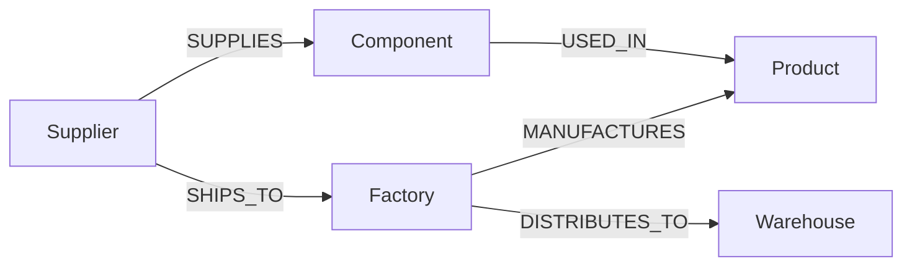

# Supply Chain Risk & Bottleneck Mapping

A graph-native explorer for supply chain dependencies, built on **Next.js 14 (App Router) + TypeScript + Tailwind**, backed by **CognoDB** (Neo4j, Bolt 5.0–5.4, openCypher).

## Why a graph database?

Supply chains are dependency graphs, not tables: a supplier feeds a component, a component feeds several products, a product is built at multiple factories, and each factory ships to multiple warehouses. The questions that matter — *"what breaks if this supplier fails?"* and *"which single-sourced parts are our biggest exposure?"* — are inherently **multi-hop traversals with variable fan-out**.

In a relational schema, answering either question means joining five tables (`suppliers → supplies → components → used_in → products → manufactures → factories → distributes_to → warehouses`), and the moment you aggregate (`COUNT(DISTINCT product_id)`) across a chain of one-to-many joins, the joins fan out and silently inflate or duplicate rows unless you carefully pre-aggregate at every join boundary. The join plan also grows with every additional hop, and ad-hoc questions ("now also show me tier-3 suppliers 3 hops out") require rewriting the query shape entirely.

In Cypher, the same question is a single pattern match: relationships are first-class, traversal depth is just more arrows in the pattern, and `WITH ... collect(DISTINCT ...)` controls exactly where aggregation happens — no join-fanout bugs, no query restructuring as hop count changes. This is the textbook case for a graph database, and it's why the API in this project answers both a **4-hop traversal** and a **single-source-of-failure aggregation** ([details below](#query-explanations)) each in one Cypher statement.

## Data model

```
(:Supplier {id, name, country, riskScore, tier})
      -[:SUPPLIES {leadTimeDays, unitCostUsd}]->
(:Component {id, name, category})
      -[:USED_IN {quantityPerUnit}]->
(:Product {id, name, sku})
      <-[:MANUFACTURES]-
(:Factory {id, name, location})
      -[:DISTRIBUTES_TO {avgTransitDays}]->
(:Warehouse {id, name, region})

(:Supplier) -[:SHIPS_TO {transportMode}]-> (:Factory)
```



Seed data (`scripts/seed.ts`) loads 12 suppliers, 10 components, 6 products, 4 factories, and 4 warehouses (~36 nodes, ~75 relationships) — small enough to run comfortably on a 0.5 vCPU / 256MB CognoDB instance, while still deep enough to exercise 4-hop traversal and fan-out aggregation.

## Query explanations

All queries live in [`app/api/graph/route.ts`](app/api/graph/route.ts) and use `$parameters` exclusively — no Cypher string concatenation anywhere in the codebase.

| Query | What it does | Why it's notable |
|---|---|---|
| `overview` | Fetches all nodes/relationships (capped at `$limit`) for the diagram view. | Baseline read. |
| `impact` | 4-hop traversal: `Supplier → Component → Product ← Factory → Warehouse`, parameterized by `$supplierId`. | ≥2-hop requirement — one pattern match walks a supplier disruption all the way to the warehouses that would run out of stock. |
| `bottlenecks` | Finds components with `size(collect(DISTINCT supplier)) = 1`, then aggregates downstream product/factory/warehouse reach per bottleneck, weighted by supplier risk. | The "hard for relational DBs" query — a HAVING-COUNT-equals-1 subquery joined through three more fan-out joins, expressed here as a few `WITH` stages with no join-duplication risk. |
| `suppliers` | Lightweight list for the supplier picker. | Simple lookup. |

## Setup

1. **Install dependencies**
   ```bash
   npm install
   ```
2. **Configure environment** — copy `.env.example` to `.env.local` and fill in your CognoDB credentials:
   ```bash
   cp .env.example .env.local
   ```
   ```env
   NEO4J_URI=neo4j+s://<your-cognodb-host>:7687
   NEO4J_USER=cognodb
   NEO4J_PASSWORD=<your-cognodb-password>
   NEO4J_DATABASE=neo4j
   ```
   Secrets are read exclusively from environment variables ([`lib/db.ts`](lib/db.ts)) — never hardcoded.
3. **Seed the database**
   ```bash
   npm run seed
   ```
   This applies uniqueness constraints on `id` per label, clears any previous demo data, and loads the dataset via batched, parameterized `UNWIND` writes.
4. **Run the app**
   ```bash
   npm run dev
   ```
   Open [http://localhost:3000](http://localhost:3000).

## Architecture

- **`lib/db.ts`** — singleton Neo4j driver (small connection pool sized for a 0.5 vCPU/256MB instance), a `DatabaseConnectionError` wrapper, and a `runQuery()` helper that always opens/closes a session and never leaks credentials or raw driver errors to callers.
- **`app/api/graph/route.ts`** — one API route, four query types (`overview`, `suppliers`, `impact`, `bottlenecks`) selected via `?type=`, each backed by a parameterized Cypher statement. Returns `503` if CognoDB is unreachable and `502` on query failure, with a user-safe error message.
- **`app/page.tsx`** — client-side tabbed UI (Overview / Impact Analysis / Bottlenecks) with explicit loading (skeletons), empty, and error (with retry) states for every panel, keyboard-operable tabs (`role="tablist"`/`role="tab"`), and an accessible SVG dependency diagram (`role="img"` + per-node `<title>`, plus a text legend as a non-visual fallback).
- **`scripts/seed.ts`** — standalone script (`tsx`) that loads the demo dataset using the same parameterized-write discipline as the API.

## Screenshots

_Add screenshots of the Overview, Impact Analysis, and Bottlenecks tabs here after running `npm run dev` against a seeded CognoDB instance, e.g.:_

```markdown


```
